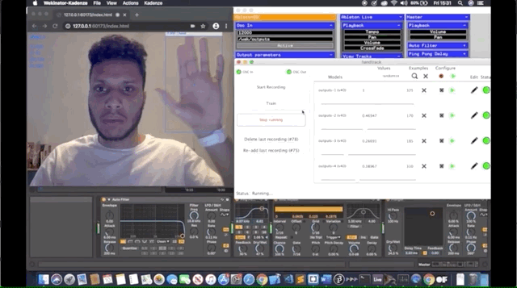

# Music-And-Machine-Learning

## Overview

An interactive work of music, where the user controls the music using hand movement through a computer webcam. This is done using the JavaScript library 
Handtrack.js and the machine learning software Wekinator to control audio effects in Ableton Live.



## Setup

**Step 1:** Clone or download this repo.

**Step 2:** Download and install [node](https://nodejs.org/en/), then clone or download the [P5js-osc](https://github.com/genekogan/p5js-osc) repository. 

**Step 3:** Open up a terminal and ```cd``` into the ```p5js-osc``` directory then enter: 

```
npm install
node bridge.js
```

**Step 4:** Run the ```p5Handtrack``` sketch in Chrome.

**Step 5:** Download and Install the [WekiInputHelper](http://www.wekinator.org/input-helper/). Run the ```WekiInputHelper``` then open the ```myHandtrackHelper.inputproj``` file.

**Step 6:** Download and Install [Wekinator](http://www.wekinator.org/downloads/). Run ```Wekinator``` then open the ```handtrack.wekproj``` file.

**Step 6:** Download and Install [Ableton Live 10](https://www.ableton.com/en/trial/)
then open the handtrack ```project.als``` file.

**Step 7:** Clone the [LiveOSC](https://github.com/ideoforms/LiveOSC) repository into the Ableton Live Scripts folder

(on macOS terminal) 

```
cd /Applications/Ableton*.app/Contents/App-Resources/MIDI\ Remote\ Scripts
git clone https://github.com/ideoforms/LiveOSC.git
```

Then go back into ```Ableton Live```, and navigate to ```Live``` > ```Preferences``` > ```Link MIDI``` then set ```Control Surface 1``` to ```LiveOSC```.

**Step 8:** Download the openFrameworks program [AbletonOSC](https://github.com/genekogan/ofxAbletonLive/releases) 
Make sure Ableton Live is running first, then run ```AbletonOSC``` 
Then under ```View Tracks``` select ```Master```, then under ```Audio Filter``` select ```Frequency```, next under ```Ping Pong Delay``` select ```Dry/Wet```, next under ```Beat Repeat``` select ```Interval```, and finally under ```Flanger``` select ```Dry/Wet```.

**Step 9:** Hit run on Wekinator to start controlling the music!  

